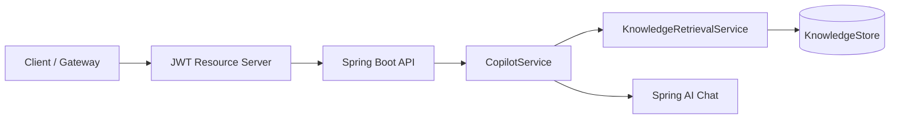

# AI Support Copilot API

AI-powered support copilot API built with Spring Boot and Spring AI, designed for grounded answers through retrieval-augmented generation (RAG), structured response contracts, and production-ready observability.

## Why this project

Support teams need fast and reliable answers, but generic AI chat often misses product context and creates compliance risk. This project focuses on:

- Grounded responses using internal knowledge retrieval
- Strict API response structures for downstream automation
- Guardrails for safer production usage
- Clear observability for latency, quality, and cost signals

## MVP scope (v1)

Version 1 delivers a backend API that:

- Accepts support questions with business context
- Retrieves relevant knowledge snippets from a vector store
- Generates a grounded answer with Spring AI
- Returns typed JSON with confidence and citations
- Exposes health and metrics endpoints for operations

## Architecture decisions

See [docs/ADR-001-retrieval-security-and-deployment.md](docs/ADR-001-retrieval-security-and-deployment.md) for retrieval modes, JWT security model, and deployment assumptions.

## Local development

- **IDE:** Open this repository’s root directory (where `pom.xml` lives) so search, refactor, and builds apply to this project.
- **Requirements:** JDK **21** and **Apache Maven** on your `PATH`.
- **Build and tests (same as CI):** `mvn -B clean verify`

## Authentication

Business APIs require a **Bearer JWT** (HS256). Set `COPILOT_JWT_SECRET` to a strong value in real environments; the default in `application.properties` is for local development only. The `prod` profile reads the signing key from `COPILOT_JWT_SECRET` and does not fall back to a default.

JWT claim **`roles`** (string array):

| Role | Access |
|------|--------|
| `AGENT` | `POST /api/copilot/**`, `GET /api/retrieval/**` |
| `ADMIN` | `POST /api/knowledge/ingest` plus everything `AGENT` can call |

`GET /api/health`, selected Actuator endpoints, and OpenAPI/Swagger URLs are anonymous. In Swagger UI use **Authorize** and send `Bearer <your-jwt>`.

## Planned architecture



Core components:

- **API Layer (Spring Boot):** request validation, auth hooks, response shaping
- **Copilot Service:** prompt orchestration, retrieval enrichment, output parsing
- **Retrieval Layer:** vector search over indexed support content
- **LLM Adapter (Spring AI):** model invocation and structured output mapping
- **Observability:** metrics, tracing, logs, and quality diagnostics

High-level flow:

1. Client obtains a JWT with appropriate `roles`, then calls `POST /api/copilot/answer`
2. API validates request and enriches runtime context
3. Retriever fetches top-k relevant documents
4. Prompt is composed with policy + retrieved context
5. Spring AI invokes model and maps to typed response
6. API returns answer, confidence, sources, and suggested actions

## API design (draft)

### `POST /api/copilot/answer` (implemented)

Request body:

```json
{
  "ticketId": "TCK-10021",
  "question": "Customer cannot reset their password after MFA enrollment.",
  "customerTier": "enterprise",
  "product": "identity-service",
  "language": "en"
}
```

Guardrail behavior:
- Basic PII masking is applied to model/fallback answers (email, phone, and card-like numbers).
- Responses with masked sensitive content are flagged for escalation.

Response body:

```json
{
  "answer": "Use the MFA recovery workflow and verify backup factors before password reset.",
  "confidence": 0.84,
  "sources": [
    {
      "id": "kb-241",
      "title": "MFA Recovery Procedure",
      "score": 0.91
    }
  ],
  "suggestedActions": [
    "Verify customer identity using enterprise policy",
    "Trigger backup-factor recovery flow",
    "Reset password after MFA recovery succeeds"
  ],
  "escalationRequired": false
}
```

### `POST /api/knowledge/ingest` (implemented)

Upserts documents into the retrieval store for future grounded responses.

Request body:

```json
{
  "id": "kb-999",
  "title": "Tenant Reset Workflow",
  "content": "Reset tenant credentials after ownership verification.",
  "confidenceScore": 88
}
```

## Retrieval store options

The project supports interchangeable retrieval stores behind the `KnowledgeStore` abstraction:

- `in-memory` (default): fast local development
- `pgvector`: PostgreSQL-backed store with vector embeddings and cosine similarity search

Switch store type in `application.properties`:

```properties
copilot.retrieval.store-type=in-memory
```

For pgvector mode, set:

```properties
copilot.retrieval.store-type=pgvector
spring.datasource.url=jdbc:postgresql://localhost:5432/copilot
spring.datasource.username=postgres
spring.datasource.password=postgres
copilot.retrieval.embedding-dimensions=1536
```

Or run with the `pgvector` profile:

```bash
mvn spring-boot:run -Dspring-boot.run.profiles=pgvector
```

### `GET /api/health`

Basic liveness/readiness check for runtime health.

### `GET /api/metrics`

Metrics endpoint for platform monitoring.

### `GET /api/retrieval/search` (implemented)

Debug endpoint to inspect retrieval relevance and scores for tuning.

- `minScore` must be between **0.0** and **1.0** (inclusive). It is the minimum cosine-style similarity used by pgvector retrieval (`1 - distance`); values outside that range are rejected with HTTP 400.
- The route is registered only when `copilot.retrieval.debug-search-enabled=true`. The default in `application.properties` is **true** for local use; the **`prod`** profile loads `application-prod.properties`, which sets it to **false** so the endpoint is not exposed unless you opt back in.

Example:

```bash
curl -H "Authorization: Bearer YOUR_JWT" \
  "http://localhost:8080/api/retrieval/search?query=mfa%20password%20reset&topK=3&minScore=0.3"
```

### API docs

- OpenAPI JSON: `GET /api-docs`
- Swagger UI: `GET /swagger-ui.html`

## Tech stack (planned)

- Java 21
- Spring Boot 3.x
- Spring AI
- Vector store: PostgreSQL + pgvector (initial option)
- OpenAPI / Swagger
- Micrometer tracing + OTLP export (OpenTelemetry)
- Docker + docker-compose
- GitHub Actions CI

## Non-functional goals

- P95 response latency under 2.5s for common support questions
- Consistent typed output for integration with ticketing workflows
- Traceable citations in every grounded response path
- Safe fallback behavior when retrieval quality is low

## Development roadmap

### Milestone 1: Bootstrap

- Initialize Spring Boot project
- Add baseline package structure
- Add `/api/health`
- Add build, lint, and test setup

### Milestone 2: Core copilot endpoint

- Implement `POST /api/copilot/answer`
- Add request/response DTOs
- Add prompt templates and output parser

### Milestone 3: Retrieval

- Add document ingestion pipeline
- Add vector search and top-k retrieval
- Attach citations to output payload

### Milestone 4: Hardening

- Add guardrails and policy checks
- Add traces, metrics, structured logs
- Add integration tests and CI gate

## Project structure (target)

```text
ai-support-copilot-api/
  src/main/java/.../api
  src/main/java/.../copilot
  src/main/java/.../retrieval
  src/main/java/.../model
  src/main/java/.../config
  src/test/java/.../
  docs/
  docker/
  README.md
```

## Local setup

### Prerequisites

- Java 21
- Maven 3.9+

### Run locally

Application configuration lives in `src/main/resources/application.properties`.

```bash
mvn spring-boot:run
```

### Run with pgvector locally

Start PostgreSQL with pgvector enabled:

```bash
docker compose up -d
```

Then run the app with the pgvector profile:

```bash
mvn spring-boot:run -Dspring-boot.run.profiles=pgvector
```

Service starts on `http://localhost:8080`.

### Run API and Postgres with Docker

Build and start the API container plus pgvector:

```bash
docker compose up -d --build
```

The API listens on port `8080` with the `pgvector` profile and JDBC pointed at the compose database. Export `COPILOT_JWT_SECRET` (and optionally `OPENAI_API_KEY`) in your shell if you do not want the local default signing key.

### Run with OpenTelemetry OTLP export locally

Start the local OpenTelemetry Collector (and optional Postgres) with:

```bash
docker compose up -d
```

Run the app with the `otel` profile:

```bash
mvn spring-boot:run -Dspring-boot.run.profiles=otel
```

Traces and metrics are exported to the collector using OTLP HTTP on port `4318`.

### JSON structured logs (optional)

Enable JSON logs by activating the `json-logging` profile:

```bash
mvn spring-boot:run -Dspring-boot.run.profiles=json-logging
```

### Verify baseline endpoints

```bash
curl http://localhost:8080/api/health
curl http://localhost:8080/actuator/health
```

Expected `api/health` response:

```json
{
  "status": "UP"
}
```

## Contribution guidelines

This project is currently in active setup. Early contributions should prioritize:

- API contracts and validation quality
- test coverage for response correctness
- retrieval quality and citation correctness
- observability and operational readiness

## Current status

Milestones 1-4 baseline are in place:

- Spring Boot project initialized with Maven
- baseline package structure added
- `GET /api/health` endpoint implemented
- actuator and test dependencies configured
- `POST /api/copilot/answer` endpoint with request validation and typed response DTOs
- retrieval abstraction and in-memory retrieval implementation added
- Spring AI chat integration wired with environment-based API key config
- `POST /api/knowledge/ingest` endpoint implemented for retrieval store upserts
- pgvector `KnowledgeStore` uses vector embeddings + cosine similarity for retrieval
- OpenAPI/Swagger enabled for interactive API exploration
- request correlation IDs added (`X-Request-Id`) with unified error payloads
- GitHub Actions CI workflow added (`mvn clean verify`)
- optional OTLP tracing/metrics export profile (`otel`) + local collector in `docker-compose.yml`
- optional JSON logging profile (`json-logging`) via `logback-spring.xml`
- basic PII guardrails added with redaction + escalation signaling in copilot responses
- golden JSON fixtures plus parameterized tests for stable copilot regression checks
- Resilience4j rate limits on copilot and ingest routes with JSON 429 responses
- Docker image and compose service wiring the API to Postgres pgvector

## License

MIT (to be added).

